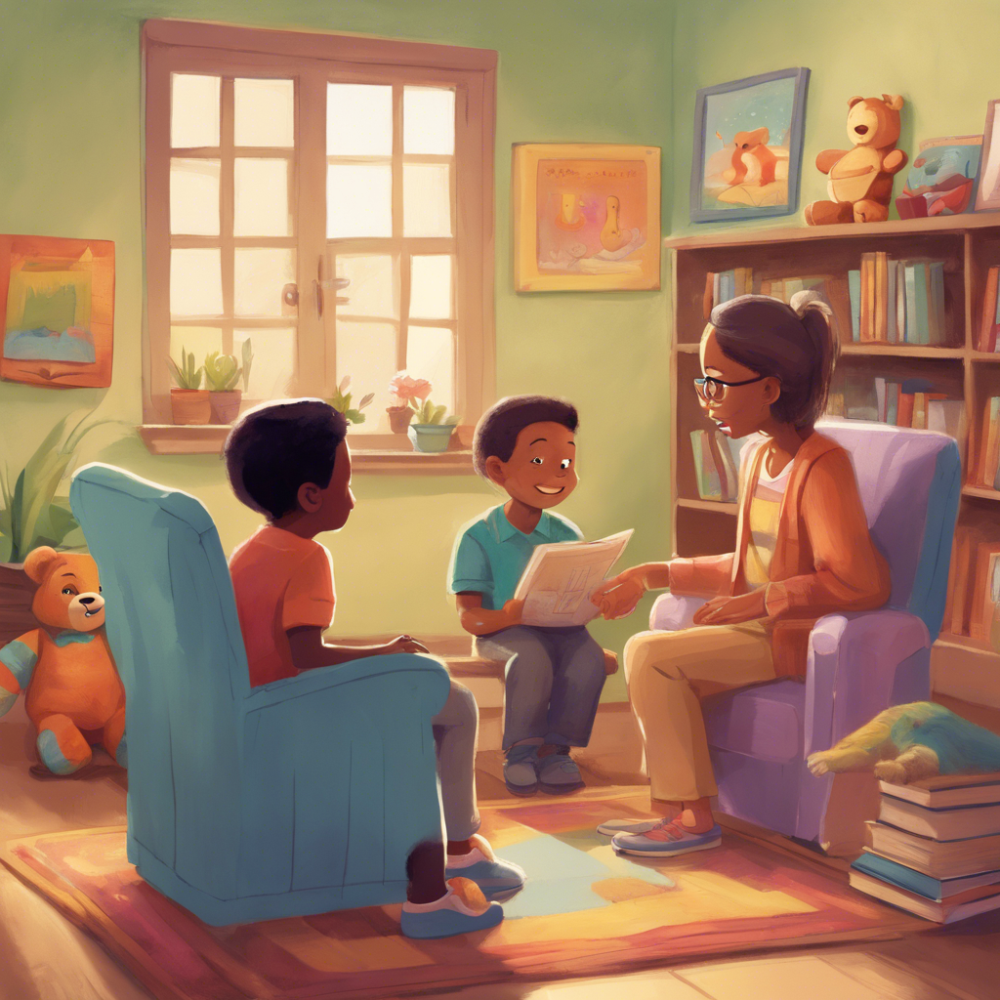

# 수도권 ICT 올인원 Pass! 인공지능 프로젝트 마스터 1기
* KICT 프로젝트반

	파이썬@ 
	   <a href='https://www.facebook.com/dongjo.lim.7'>LDJ</a>
	, [임동조](colabstart@gmail.com)

<h2><b> 프로젝트 정리 </b></h2>

## Notice for Team Project

최종 프로젝트 진행
* 기간 : 2025.03.12(수) ~ 2025.05.13(화)  

<table border=1 bgcolor="#EEEEEE">
	<tr bgcolor="#CC0000">
		<td width="100">
		
<b>Team Name</b>

		</td>
		<td width="100">
		
<b>Team Building</b>

		</td>
		<td width="300">
		
<b>Project Subject</b>

		</td>
		<td width="150">
		
<b>데이터 URL</b>

		<td width="200">
		
<b>Reports</b>

		</td>
	</tr>
	<tr>
		<td>
		
 따로국밥 

		</td>
		<td>
			
 김사훈(팀장), 이만오, 김아름, 장대영, 강유진 

		</td>
		<td>
			
 지능형 노인 낙상 감지 및 인터랙티브 알림 시스템 

		</td>
		<td>
			
  
			PDF <a href="https://ldjwj.github.io/Goorm_2025_ICT1234_allinOne/ICT01_2503_2505/last_reports/따로국밥_V10_250512.pdf"> 이동 </a>			
			

		</td>
	   <td>
		   
 github  <a href=""> 이동  </a>

		</td>
	</tr>
	<tr>
		<td>
		
 EasyQC 

		</td>
		<td>
			
 차경호(팀장), 김정현, 윤율, 전명환 

		</td>
		<td>
			
 스마트폰을 활용한 불량품 판별 시스템 개발 

		</td>
		<td>
			
  
			PDF <a href="https://ldjwj.github.io/Goorm_2025_ICT1234_allinOne/ICT01_2503_2505/last_reports/EasyQC_V10_250512.pdf"> 이동 </a>			
			

		</td>
	   <td>
		   
 github  <a href=""> 이동  </a>

		</td>
	</tr>
	<tr>
		<td>
		
 DeepRoad 

		</td>
		<td>
			
 김주한(HW, SW)(팀장), 신서연(SW, 발표 준비), 안수빈 

		</td>
		<td>
			
 라즈베리파이 기반의 자율주행 자동차의 기본을 개발 

		</td>
		<td>
			
  
			PDF <a href="https://ldjwj.github.io/Goorm_2025_ICT1234_allinOne/ICT01_2503_2505/last_reports/DeepRoad_V10_250512.pdf"> 이동 </a>			
			

		</td>
	   <td>
		   
 github  <a href=""> 이동  </a>

		</td>
	</tr>
	<tr>
		<td>
		
 콘텐츠브랜더스 

		</td>
		<td>
			
 김병제(팀장), 배해성, 최소현 

		</td>
		<td>
			
 성과형 브랜드 콘텐츠 자동화 서비스 

		</td>
		<td>
			
  
			PDF <a href="https://ldjwj.github.io/Goorm_2025_ICT1234_allinOne/ICT01_2503_2505/last_reports/콘텐츠마스터_V10_250512.pdf"> 이동 </a>			
			

		</td>
	   <td>
		   
 github  <a href=""> 이동  </a>

		</td>
	</tr>
	<tr>
		<td>
		
 밥알지니어스 

		</td>
		<td>
			
 이건우(팀장), 문초연, 이진아, 이시연 

		</td>
		<td>
			
 오늘 어떤 메뉴가 좋을까? 

		</td>
		<td>
			
  
			PDF <a href="https://ldjwj.github.io/Goorm_2025_ICT1234_allinOne/ICT01_2503_2505/last_reports/밥알지니어스_V10_250512.pdf"> 이동 </a>			
			

		</td>
	   <td>
		   
 github  <a href=""> 이동  </a>

		</td>
	</tr>
</table>

 

 &lt; The End &gt; 

